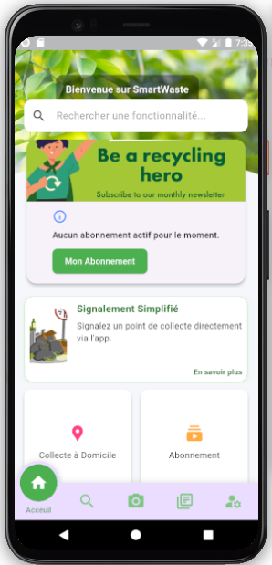
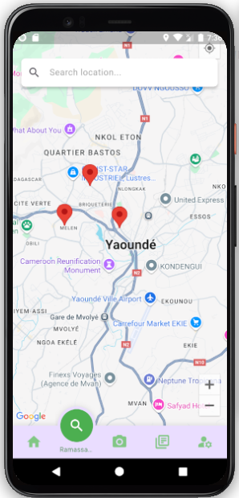
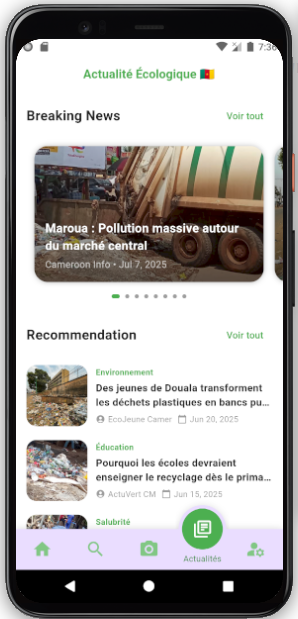
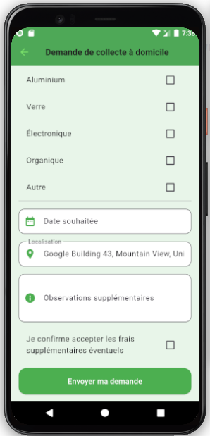

# ♻️ SmartWaste

A **smart waste management system** designed to improve waste collection efficiency and sustainability.  
Built with **IoT & smart monitoring concepts**, the project demonstrates how technology can support **cleaner and greener cities**.  

---

## 🌍 About the Project

SmartWaste provides an **intelligent way of handling waste** by combining **real-time monitoring** and **data-driven decision making**.  

### Key Features
- 🗑️ **Smart bins** equipped with sensors to detect fill levels  
- 📊 **Real-time monitoring dashboard** for waste status  
- 🚛 **Optimized collection routes** to save time and resources  
- 🌱 Support for **recycling initiatives** and **sustainability**  

---

## 🖼️ Screenshots

  
  
  
  

---

## ⚙️ Tech Stack

- **Frontend**: Flutter (Dart)  
- **Backend**: Firebase (Authentication, Firestore, Cloud Functions)  
- **IoT Simulation**: Sensors & real-time data feeds  
- **Maps/Routes**: Google Maps API  

---

## 📩 Acquire this Project

The **full source code of SmartWaste is private** and not publicly available.  
If you are interested in acquiring or collaborating on this project, please contact:

- 📧 Email: **yveslucas20@gmail.com**

---
